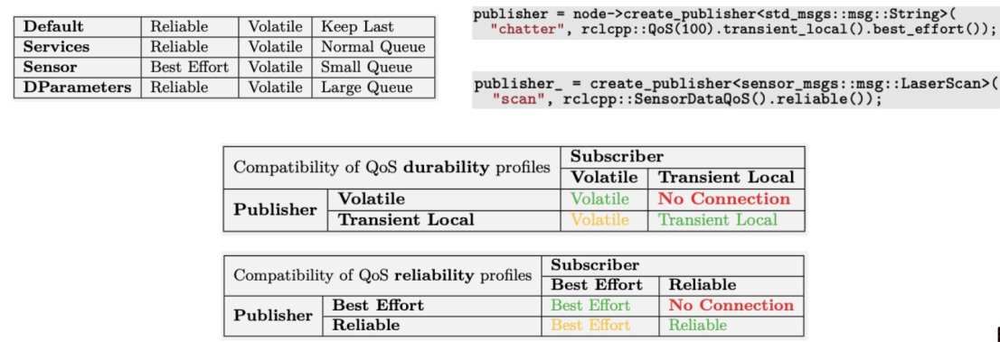

# #2 ROS Programming

## Content
- [ROS2 Design](#ros2-design)
- [rclcpp](#rclcpp)
- [ROS Packages](#ros-packages)
- [Services](#services)
- [Launch files](#launch-files)
- [QoS](#quality-of-service)

## ROS2 Design
ROS 2 is built on top of DDS/RTPS as its middleware:
- Distributed discovery
- Serialization
- QoS Transportation

DDS is an industry standard, there are several vendors

## RCLCPP
`rclcpp` is a canonical C++ API for interacting with ROS

Main components:
- Node
- Publisher and subscription
- service server and client
- timers and rates
- parameters
- executors
- instrospection or ROS graph
- loggin -> including macros, e.g. RCLCPP_INFO()

The basic code could be this:
```
int main(int argc, char * argv[])
{
  rclcpp::init(argc, argv);
  rclcpp::spin(std::make_shared<MinimalPublisher>());
  rclcpp::shutdown();
  return 0;
}
```

## ROS Packages
A package is an organizational unit for your ROS2 code.
Package contents (C++):
- `CMakeLists.txt` file that describes how to build the code within the package
- `include/<package_name>` directory containing the public headers for the package
- `package.xml` file containing meta information about the package
- `src` directory containing the source code for the package

Installing 3rd party packages
- Debian packages
    - Easy and fast
- Source code respositories
    - Mostly Github
    - More effort, more control

How to install ROS Packages (debian)?
```
sudo apt install ros-humble-package
```

### Exercise
First check if do you have Git installed:
```
sudo apt install git
```
also for Gazebo:
```
sudo apt install gazebo
sudo apt install ros-humble-gazebo-ros-pkgs
sudo apt-get install ros-humble-ros-gz
```
Now we will need to create a new workspace:
```
mkdir -p ~/turtlebot3_ws/src
```
We are going to install `turtlebot` simulations packages and dependencies, please be aware that you should install all the packages in the `~/turtlebot3_ws/src`
```
cd ~/turtlebot3_ws/src
git clone https://github.com/ROBOTIS-GIT/turtlebot3_simulations.git -b humble-devel
git clone https://github.com/ROBOTIS-GIT/turtlebot3.git -b humble-devel
git clone https://github.com/ROBOTIS-GIT/turtlebot3_msgs.git -b humble-devel
git clone https://github.com/ROBOTIS-GIT/DynamixelSDK.git -b humble-devel
```
now compile the package... but...\
... remember! that `colcon build` must **ALWAYS** be executed from your ros2_ws.\
Also note that:
- DEBUG mode is always by default.
- Packages can be ignored by adding an empty file with the name COLCON_IGNORE (this is really powerfull).
- You can select which packages to compile with: `--packages-select the_package_name`

```
cd ~/turtlebot3_ws && colcon build
```
Select the model of your choice (burger or waffle, you can change it later):
```
echo "export TURTLEBOT3_MODEL=burger" >> ~/.bashrc
```
Close and open the terminal, move to the `~/turtlebot3_ws` folder and there run the simulation:
```
source ~/turtlebot3_ws/install/setup.bash
ros2 launch turtlebot3_gazebo turtlebot3_world.launch.py
```
you should see Gazebo opening with the simulation (robot, blue laser, environment, etc.).

Now check the avaible topics with:
```
ros2 topic list
```
Now check the message type and structure for topic `/cmd_vel` with:
```
ros2 topic info /cmd_vel
```
you will see the next:

```
Type: geometry_msgs/msg/Twist 
Publisher count: 0
Subscription count: 1
```
you can look for the `Twist` structure on internet. 
Here is the good source to see that kind of information: [http://docs.ros.org/en/noetic/api/geometry_msgs/html/msg/Twist.html](http://docs.ros.org/en/noetic/api/geometry_msgs/html/msg/Twist.html). There you will see that the structure is the following:
```
geometry_msgs/Vector3 linear
geometry_msgs/Vector3 angular
```
clicking on either of the two you will see the next:
```
float64 x
float64 y
float64 z
```
that is, you can publish a `\cmd_vel` command this way:
```
auto message = geometry_msgs::msg::Twist();
message.angular.z = 1;
RCLCPP_INFO(this->get_logger(), "Publishing: '%f'", message.angular.z);
publisher_->publish(message);
```
or you can *publish* info directly with the console. For example use the following velocity commands to teleoperate the robot:
```
ros2 topic pub -1 /cmd_vel geometry_msgs/msg/Twist "{linear: {x: 0.0, y: 0.0, z: 0.0},
angular: {x: 0.0, y: 0.0, z: 1.0}}"
```
the turtle robot should start to turn on itself with a speed of 1 rad/s

### Creating a ROS package
Before continuing with another exercise let's gonna review about the packages and how are they structured.

First we can create a folder for a project or a new package:
```
mkdir my_new_proyect/src
```
now go into this folder:
```
cd my_new_project/src
```
and create the package with the next command:
```
ros2 pkg create --build-type ament_cmake --node-name my_node my_package
```
you will end with this structure:
```
/Home
  /my_new_project
    /src
      /my_package
        /include
        /src
          /my_node.cpp
        CMakeLists.txt
        package.xml
```
now is time to compile `my_package`, we should go (ALWAYS!!!) to `my_new_project` directory and once there run the following command:
```
colcon build --packages-select my_package
```
### Package.xml

In the `package.xml` you will add meta information about your new package. 
- Complete your `name` and your `mail` on the `maintainer` line
- Complete the package `description` summarizing the main aspects. For example:
  ```
  <description>Beginner client libraries tutorials practice package</description>
  ```
- Complete the `license` line. You can read more [here](https://opensource.org/licenses/alphabetical). Since this package is only for practice, it’s safe to use any license. We’ll use `Apache License 2.0`.

Below the license tag, you will see some tag names ending with `_depend`. This is where your `package.xml` would list its dependencies on other packages, for colcon to search for. my_package is simple and doesn’t have any dependencies, but you will see this space being utilized in upcoming tutorials.

### Exercise 2

1. Create a new package to move the simulated turtlebot. 

First we should go to the `turtlebot3_ws/src/` folder and there type:
```
ros2 pkg create robot_controller --dependencies rclcpp nav_msgs geometry_msgs --build-type ament_cmake
```

2. Create a subscriber to receive and print odometry data from the turtlebot simulation.

In order to do so, we can visit this web: [https://docs.ros.org/en/humble/Tutorials/Beginner-Client-Libraries/Writing-A-Simple-Cpp-Publisher-And-Subscriber.html](https://docs.ros.org/en/humble/Tutorials/Beginner-Client-Libraries/Writing-A-Simple-Cpp-Publisher-And-Subscriber.html) and copy the pusblisher and subscriber code into two different files in the `src` folder within the package. The files can be named: `publisher_cmd.cpp` and `subscriber_odom.cpp`, for example.

We need to modify them so everything works properly:
- In the publisher:
  - Include `geometry_msgs/msg/twist.hpp`
  - rename the node class as `VelocityPublisher`, also the node constructor use this name.
  - Also the publisher is initialize with the `geometry_msgs` message type; and the topic name `cmd_vel`.
- In the subscriber:
  - Include the `nav_msgs/msg/odometry.hpp` header
  - Rename the class as `OdomSubscriber` 
  - use the `nav_msgs::msg::Odometry` message type
  - with topi name `odom`.


3. Create a publisher to move the turtlebot by sending random commands to topic /cmd_vel

We are going to create another node (`.cpp` file) in the `robot_controller/src/` folder. The name will be `random`. And the code that easily implements that could be something like this: 
```
srand (time(NULL));
int random = rand() % 10 + 1;
message.angular.z = ((float) random)/8.5;
message.linear.x = ((float) random)*0.1;
```

4. Check the publisher frequency

You can do that with the help of:
```
ros2 topic hz /cmd_vel
```
you will see that the rate is about `2 Hz`. If you test it  with the `/odom` you will se a rate around `18 Hz`.

5. Check your nodes info

It can be easily done with `ros2 topic info /topic_name`.

6. (Optional) Use the odometry data to move the robot towards a target point

This exercise is all for you. Basically closing the loop thanks to the `odom` data and implementing a simple robot controller: P, PD? Something like that will be enough.

## Services
Services are another **method of communication** for `nodes` in the ROS graph. Services are **based on a call-and-response model** versus the publisher-subscriber model of `topics`. While topics allow nodes to subscribe to data streams and get continual updates, **services only provide data when they are specifically called by a client**.

> There can be many services clients using the same service. But there can be only one service server for a service.

When `nodes` communicate using *services*, the node that sends a request for data is called the **client node**, and the one that responds to the request is the **service node**. The structure of the request and response is determined by a `.srv` file.

### Exercise

The example used here is a simple integer addition system; one node requests the sum of two integers, and the other responds with the result.

Navigate into the `ros2_ws` directory created in a previous tutorial.

Recall that packages should be created in the `src` directory, not the root of the workspace. Navigate into `ros2_ws/src` and create a new package:

```
ros2 pkg create --build-type ament_cmake --license Apache-2.0 cpp_srvcli --dependencies rclcpp example_interfaces
```
Your terminal will return a message verifying the creation of your package `cpp_srvcli` and all its necessary files and folders.

The `--dependencies` argument will automatically add the necessary dependency lines to `package.xml` and `CMakeLists.txt`. `example_interfaces` is the package that includes the `.srv` file you will need to structure your requests and responses:
```
int64 a
int64 b
---
int64 sum
```
The first two lines are the parameters of the request, and below the dashes is the response.

Go to this link: [https://docs.ros.org/en/humble/Tutorials/Beginner-Client-Libraries/Writing-A-Simple-Cpp-Service-And-Client.html](https://docs.ros.org/en/humble/Tutorials/Beginner-Client-Libraries/Writing-A-Simple-Cpp-Service-And-Client.html) there you will find the `.cpp` files, one for the service node and other for the client.

Inside the `ros2_ws/src/cpp_srvcli/src` directory, create a new file called `add_two_ints_server.cpp` and paste the code for the service. Do the same for the `add_two_ints_client.cpp` file (in the same folder).

Finally edit the `CMakeLists.txt` to add the executable and target for the new node. After removing some unnecessary boilerplate from the automatically generated file, your CMakeLists.txt should look like this:

```
cmake_minimum_required(VERSION 3.5)
project(cpp_srvcli)

find_package(ament_cmake REQUIRED)
find_package(rclcpp REQUIRED)
find_package(example_interfaces REQUIRED)

add_executable(server src/add_two_ints_server.cpp)
ament_target_dependencies(server rclcpp example_interfaces)

add_executable(client src/add_two_ints_client.cpp)
ament_target_dependencies(client rclcpp example_interfaces)

install(TARGETS
  server
  client
  DESTINATION lib/${PROJECT_NAME})

ament_package()
```

We should build the package from the workspace root: `ros2_ws` running:
```
colcon build --packages-select cpp_srvcli
```
Open a new terminal, navigate to `ros2_ws`, and source the setup files:
```
source install/setup.bash
```
now run the service node:
```
ros2 run cpp_srvcli server
```
Open another terminal, source the setup files from inside `ros2_ws` again. Start the client node, followed by any two integers separated by a space:

```
ros2 run cpp_srvcli client 2 3
```
enjoy the adding!

## Launch files

There are three format alternatives:
- Python
- XML
- Yaml

Why using launch files? They provide some functionalities:
- Start/stop different nodes
- Parameters
- ROS2  conventions and configurations

What means basically that: the configuration of the system includes what programs to run, where to run them, what arguments to pass them, and ROS-specific conventions which make it easy to reuse components throughout the system by giving them each a different configuration. It is also responsible for monitoring the state of the processes launched, and reporting and/or reacting to changes in the state of those processes.

### Exercise
We are going to create a launch file for the `robot_controller` package. Basically it will lauch two nodes.

Firstly, create a new folder called `launch` in your package folder:
```
mkdir launch
```
there, create a file called `launch_controller`:
```
touch controller_launch.py 
```
> using `_launch.py` is recommended, but not required, as the file suffix for Python launch files. However, the launch file name needs to end with `launch.py` to be recognized and autocompleted by `ros2` launch!!

Then, visit [this](https://docs.ros.org/en/foxy/Tutorials/Intermediate/Launch/Creating-Launch-Files.html#) website where you can find examples of `launch files`. Copy and paste one. 

They are designed for turtlesim, but we are going to change them a little. 

This is the final result:
```
def generate_launch_description():
    return LaunchDescription([
        Node(
            package='robot_controller',
            executable='listener',
            name='listener'
        ),
        Node(
            package='robot_controller',
            executable='random',
            name='random'
        ),
    ])
```
Now build the package with:
```
colcon build --packages-select robot_controller
```
And finally, in order to execute it use:
```
ros2 launch robot_controller controller_launch.py
``` 

## Quality of Service
ROS 2 provides a range of Quality of Service (QoS) policies to optimize communication between nodes, ranging from reliable TCP to best-effort UDP. Its flexibility is particularly useful in lossy wireless networks or real-time computing systems. A QoS profile is formed by combining a set of QoS policies, which can be specified for publishers, subscriptions, service servers, and clients. However, different profiles may be incompatible, potentially preventing message delivery.

Here you can find more info: [https://docs.ros.org/en/rolling/Concepts/Intermediate/About-Quality-of-Service-Settings.html](https://docs.ros.org/en/rolling/Concepts/Intermediate/About-Quality-of-Service-Settings.html)

### QoS policies

The base QoS profile currently includes settings for the following policies:

- **History**
  - **Keep last**: only store up to N samples, configurable via the queue depth option.
  - **Keep all**: store all samples, subject to the configured resource limits of the underlying middleware.
- **Depth**
  - **Queue size**: only honored if the “history” policy was set to “keep last”.
- **Reliability**
  - **Best effort**: attempt to deliver samples, but may lose them if the network is not robust.
  - **Reliable**: guarantee that samples are delivered, may retry multiple times.
- **Durability**
  - **Transient local**: the publisher becomes responsible for persisting samples for “late-joining” subscriptions.
  - **Volatile**: no attempt is made to persist samples.
- **Deadline**
  - **Duration**: the expected maximum amount of time between subsequent messages being published to a topic
- **Lifespan**
  - **Duration**: the maximum amount of time between the publishing and the reception of a message without the message being considered stale or expired (expired messages are silently dropped and are effectively never received).
- **Liveliness**
  - **Automatic**: the system will consider all of the node’s publishers to be alive for another “lease duration” when any one of its publishers has published a message.
  - **Manual by topic**: the system will consider the publisher to be alive for another “lease duration” if it manually asserts that it is still alive (via a call to the publisher API).
- **Lease Duration**
  - **Duration**: the maximum period of time a publisher has to indicate that it is alive before the system considers it to have lost liveliness (losing liveliness could be an indication of a failure).

The system default option for policies without durations uses the underlying middleware's default, while the default option for duration policies has an unspecified duration, often interpreted as infinite.

