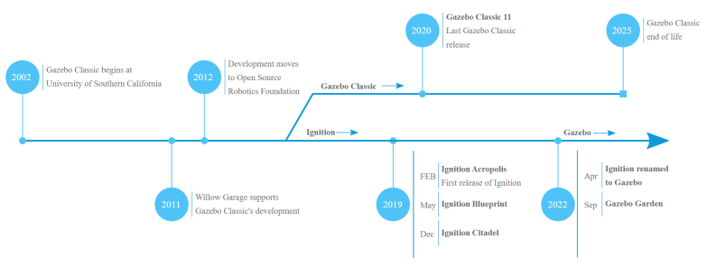

# #4 Gazebo
- [Introduction](#introduction)
- [Gazebo Installation](#gazebo-installation)
- [Stand-alone Gazebo Simulator](#stand-alone-gazebo-simulator)
- [Creating Simulations with Gazebo](#creating-simulations-with-gazebo)
- [Gazebo Connection - ROS2](#gazebo-connection---ros2)

## Introduction
Initially Gazebo emerged as a simulator for ROS (currently Gazebo Classic 11) which will end in 2025. But over time it became independent as an ubuntu simulator. The latter was called Ignition, which has now been renamed Gazebo due to copyright issues. As the current version of Gazebo Garden is very recent. We will use the latest LTS of Gazebo which is called Ignitio Fortress.



Fortress was released in december 2019 and it is recommended for ROS2 Humble.


## Gazebo Installation
Open the next link: 
```
https://gazebosim.org/docs/latest/ros_installation
```
There you will find this installation command along with more relevant info: 
```
sudo apt-get install ros-humble-ros-gz
```
Is important to select the best compatible ROS and Gazebo combination.

If you type 
```
gazebo
```
in your terminal, you will be opening the `Gazebo Classic 11`. 

If you want to open the `Ignition Fortress` type:
```
ign gazebo
``` 
## Stand-alone Gazebo Simulator
Now we are going to follow these tutorials:
```
https://gazebosim.org/docs/fortress/tutorials
```
Open the first: `Building your own robot`. 
During this one we will learn how to use `.sdf` files. 

Opening the code in this link [https://github.com/gazebosim/docs/blob/master/harmonic/tutorials/sdf_worlds/world_demo.sdf](https://github.com/gazebosim/docs/blob/master/harmonic/tutorials/sdf_worlds/world_demo.sdf) you can download the `sdf` file and open it with `ignition` with:
```
ign gazebo your_file.sdf
```

### SDF
SDF: Simulation Description Format

- **Links**: A link contains the physical properties of one body of the model. This can be a wheel, or a link in a joint chain. Each link may contain many collision and visual elements. Try to reduce the number of links in your models in order to improve performance and stability. For example, a table model could consist of 5 links (4 for the legs and 1 for the top) connected via joints. However, this is overly complex, especially since the joints will never move. Instead, create the table with 1 link and 5 collision elements.

    - **Collision**: A collision element encapsulates a geometry that is used for collision checking. This can be a simple shape (which is preferred), or a triangle mesh (which consumes greater resources). A link may contain many collision elements.

    - **Visual**: A visual element is used to visualize parts of a link. A link may contain 0 or more visual elements.

    - **Inertial**: The inertial element describes the dynamic properties of the link, such as mass and rotational inertia matrix.

    - **Sensor**: A sensor collects data from the world for use in plugins. A link may contain 0 or more sensors.

    - **Light**: A light element describes a light source attached to a link. A link may contain 0 or more lights.

- **Joints**: A joint connects two links. A parent and child relationship is established along with other parameters such as axis of rotation, and joint limits.

- **Plugins**: A plugin is a shared library created by a third party to control a model.

### Exercise
Now, change the `sdf` file of the car adding a new `castor wheel` in the frontal side.

You will need to rename the `arbitrary frame` and adding second one for the new wheel. 

```
<!--arbitrary frame-->
<frame name="caster_frame_left" attached_to='chassis'>
    <pose>0.8 -0.3 -0.2 0 0 0</pose>
</frame>

<frame name="caster_frame_right" attached_to='chassis'>
    <pose>0.8 0.3 -0.2 0 0 0</pose>
</frame>
```

You will need to add a second `caster wheel` and edit the necessary names: `relative_to`.

Finally you will need to change the `joints`.

## Creating Simulations with Gazebo
Find [here](https://gazebosim.org/docs/fortress/sdf_worlds) the whole explanation. The SDF format is used for the creation of worlds in Gazebo.

Every SDF world starts with these tags.
```
<?xml version="1.0" ?>
<sdf version="1.8">
    <world name="world_demo">
    ...
    ...
    </world>
</sdf>
```

The most important components are:
- Physical engine: determines the interaction
- Plugins: execution code
- Light: simulation lighting
- Add models: from [Ignition Fuel](https://app.gazebosim.org/fuel)
- GUI: The interface is configurable, and offers:
    - Statistics
    - Entity tree
    - Window size
    - Etc....

### Exercise
Start up gazebo with the example of the
Nao and create a new world with 2 Nao robots.

Solution:
```
<plugin name='JointPositionController2' filename='JointPositionController'> 
    <ignition-gui>
        <property type='double' key='height'>600</property> 
        <property type='double' key='width'>400</property> 
        <property type='string' key='state'>floating</property> 
        <anchors target='3D View'> 
            <line own='right' target='right'/> 
            <line own='top' target='top'/> 
        </anchors> 
    </ignition-gui> 
    <model_name>Nao2</model_name> 
</plugin> 

<include>
    <uri> https://fueLignitionrobotics.org/1.0/OpenRobotics/models/NAO with Ignition position controller </uri> 
    <name>Nao2</name> 
    <pose>-0.3 0 0.35 0 -0 3.14</pose> 
</include> 
```

## Gazebo Connection - ROS2

Open the following link:
```
https://gazebosim.org/docs/fortress/moving_robot
```
We  are going to use a `plugin`: a plugin is a chunk of code that is compiled as a shared library and inserted into the simulation. Plugins make us control many aspects of the simulation like world, models, etc.

To make our robot move we will use the `diff_drive` plugin, which helps us control our robot, specifically a robot that can be differentially driven. Let's setup the plugin on our robot. Open the `building_robot.sdf` and add the following code within the `vehicle_blue` model tags.

```
<plugin
    filename="libignition-gazebo-diff-drive-system.so"
    name="ignition::gazebo::systems::DiffDrive">
    <left_joint>left_wheel_joint</left_joint>
    <right_joint>right_wheel_joint</right_joint>
    <wheel_separation>1.2</wheel_separation>
    <wheel_radius>0.4</wheel_radius>
    <odom_publish_frequency>1</odom_publish_frequency>
    <topic>cmd_vel</topic>
</plugin>
```

The `<plugin>` tag has two attributes, filename which takes the library file name and name which takes the name of the plugin. In the `<left_joint>` and `<right_joint>` tags we define the joints which connect the left and the right wheel with the body of the robot, in our case left_wheel_joint and right_wheel_joint. `<wheel_separation>` takes the distance between the two wheels. Our robot has its left_wheel at 0.6 m and the right_wheel at -0.6 m in y-axis with respect to the chassis, so the wheel_separation is 1.2 m. `<wheel_radius>` takes the radius of the wheel which was defined in the `<radius>` tag under the wheel link. `<odom_publish_frequency>` sets the frequency at which the odometry is published at `/model/vehicle_blue/odometry`. `cmd_vel` is the input `<topic>` to the DiffDrive plugin.

As it is a vehicle plugin it should go with the `vehicle`, usually it is placed at the end of the section where it is needed.

On one terminal we can launch the `Gazebo` simulation with:
```
ign gazebo car.sdf
```
In another terminal let's send a message to our robot:
```
ign topic -t "/cmd_vel" -m ignition.msgs.Twist -p "linear: {x: 0.5}, angular: {z: 0.05}"
```
Now you should have your robot moving in the simulation. You can play around

**Note**: Don't forget to press the play button in the simulation.

### Moving the robot using the keyboard 

Instead of sending messages from the terminal we will send messages using the keyboard keys. To do so we will add two new plugins: `KeyPublisher` and `TriggeredPublisher`.

`KeyPublisher` is an ign-gui plugin that reads the keyboard's keystrokes and sends them on a default topic `/keyboard/keypress`. Let's try this plugin as follows:

In one terminal type
```
ign gazebo building_robot.sdf
```
In the top right corner click on the plugins dropdown list (vertical ellipsis), click the `Key Publisher`.
In another terminal type
```
ign topic -e -t /keyboard/keypress
```
The last command will display all messages sent on `/keyboard/keypress` topic.

In the ignition window press different keys and you should see data (numbers) on the terminal where you run the `ign topic -e -t /keyboard/keypress` command.

We want to map these keystrokes into messages of type `Twist` and publish them to the `/cmd_vel` topic which our model listens to. The `TriggeredPublisher` plugin will do this.

The `TriggeredPublisher` plugin publishes a user specified message on an output topic in response to an input message that matches user specified criteria. Let's add the following code under the `<world>` tag:
```
<!-- Moving Forward-->
<plugin filename="libignition-gazebo-triggered-publisher-system.so"
        name="ignition::gazebo::systems::TriggeredPublisher">
    <input type="ignition.msgs.Int32" topic="/keyboard/keypress">
        <match field="data">16777235</match>
    </input>
    <output type="ignition.msgs.Twist" topic="/cmd_vel">
        linear: {x: 0.5}, angular: {z: 0.0}
    </output>
</plugin>
```
Now `launch building_robot.sdf` then add the `Key Publisher` plugin and our robot should move forward as we press the `Up arrow key ↑` (make sure you start the simulation by pressing the play button to see the robot move forward after pressing the Up arrow key).

The numbers for the other arrows are:
```
Left ➞ 16777234 ➞ linear: {x: 0.0}, angular: {z: 0.5}
Up ➞ 16777235 ➞ linear: {x: 0.5}, angular: {z: 0.0}
Right ➞ 16777236 ➞ linear: {x: 0.0}, angular: {z: -0.5}
Down ➞ 16777237 ➞ linear: {x: 0.5}, angular: {z: 0.0}
```

Play around to create a key button for moving the robot to the home pose. You will need to see which topics are being published and which one refers to the pose.

### Sensors
We want to see the acceleration suffered by the car.
To define the IMU sensor add this code under the `<world>` tag:
```
<plugin filename="libignition-gazebo-imu-system.so"
        name="ignition::gazebo::systems::Imu">
</plugin>
```
This code defines the IMU sensor plugin to be used in our world. Now we can add the IMU sensor to our robot as follows:
```
<sensor name="imu_sensor" type="imu">
    <always_on>1</always_on>
    <update_rate>1</update_rate>
    <visualize>true</visualize>
    <topic>imu</topic>
</sensor>
```
#### Read data from IMU
To read the data from the IMU, run the world in one terminal and press the play button:
```
ign gazebo car.sdf
```
In another terminal, run:
```
ign topic -e -t /imu
```
The last command listens to the messages sent over the `/imu` topic. The IMU data are orientation, `angular_velocity` and `linear_acceleration` as described above. 

#### Contact sensor
Let's introduce a wall in the simulation: 
```
<model name='wall'>
    <static>true</static>
    <pose>5 0 0 0 0 0</pose><!--pose relative to the world-->
    <link name='box'>
        <pose/>
        <visual name='visual'>
            <geometry>
                <box>
                    <size>0.5 10.0 2.0</size>
                </box>
            </geometry>
            <!--let's add color to our link-->
            <material>
                <ambient>0.0 0.0 1.0 1</ambient>
                <diffuse>0.0 0.0 1.0 1</diffuse>
                <specular>0.0 0.0 1.0 1</specular>
            </material>
        </visual>
        <collision name='collision'>
            <geometry>
                <box>
                    <size>0.5 10.0 2.0</size>
                </box>
            </geometry>
        </collision>
    </link>
</model>
```
Now we need to add a plugin to the simulation (they are usually at the top):
```
<plugin filename="libignition-gazebo-contact-system.so"
        name="ignition::gazebo::systems::Contact">
</plugin>
```
Now we can add the contact sensor to the chasis link of the vehicle model:
```
<sensor name='sensor_contact' type='contact'>
    <contact>
        <collision>collision</collision>
    </contact>
</sensor>

```
We need also to add the `TouchPlugin` under the wall model as follows:
```
<plugin filename="libignition-gazebo-touchplugin-system.so"
        name="ignition::gazebo::systems::TouchPlugin">
    <target>vehicle_blue</target>
    <namespace>wall</namespace>
    <time>0.001</time>
    <enabled>true</enabled>
</plugin>
```
 Run the world in one terminal:
```
ign gazebo sensor_tutorial.sdf
```
In another terminal, listen to the /wall/touched topic:
```
ign topic -e -t /wall/touched
```
you will see `data: true` when the car collide with the wall.

#### Lidar Sensor
Now we are going to use the `lidar` sensor in order to avoid colliding with the wall.

Lidar is an acronym for "light detection and ranging". This sensor can help us detect obstacles around the robot. We will use it to measure the distance between our robot and the wall.

First let's create a frame to fix our lidar to. This should be added inside of the `vehicle_blue` `<model>` tag, since the lidar frame is attached to the robot's `chassis`:
```
<frame name="lidar_frame" attached_to='chassis'>
    <pose>0.8 0 0.5 0 0 0</pose>
</frame>
```
Then add this plugin under the `<world>` tag, to be able to use the `lidar` sensor:
```
<plugin
    filename="libignition-gazebo-sensors-system.so"
    name="ignition::gazebo::systems::Sensors">
    <render_engine>ogre2</render_engine>
</plugin>
```
Under the `chassis` link we can add the `lidar` sensor as follows:
```
<sensor name='gpu_lidar' type='gpu_lidar'>"
    <pose relative_to='lidar_frame'>0 0 0 0 0 0</pose>
    <topic>lidar</topic>
    <update_rate>10</update_rate>
    <ray>
        <scan>
            <horizontal>
                <samples>640</samples>
                <resolution>1</resolution>
                <min_angle>-1.396263</min_angle>
                <max_angle>1.396263</max_angle>
            </horizontal>
            <vertical>
                <samples>1</samples>
                <resolution>0.01</resolution>
                <min_angle>0</min_angle>
                <max_angle>0</max_angle>
            </vertical>
        </scan>
        <range>
            <min>0.08</min>
            <max>10.0</max>
            <resolution>0.01</resolution>
        </range>
    </ray>
    <always_on>1</always_on>
    <visualize>true</visualize>
</sensor>
```
We will build a node that subscribes to the /lidar topic and reads its data.